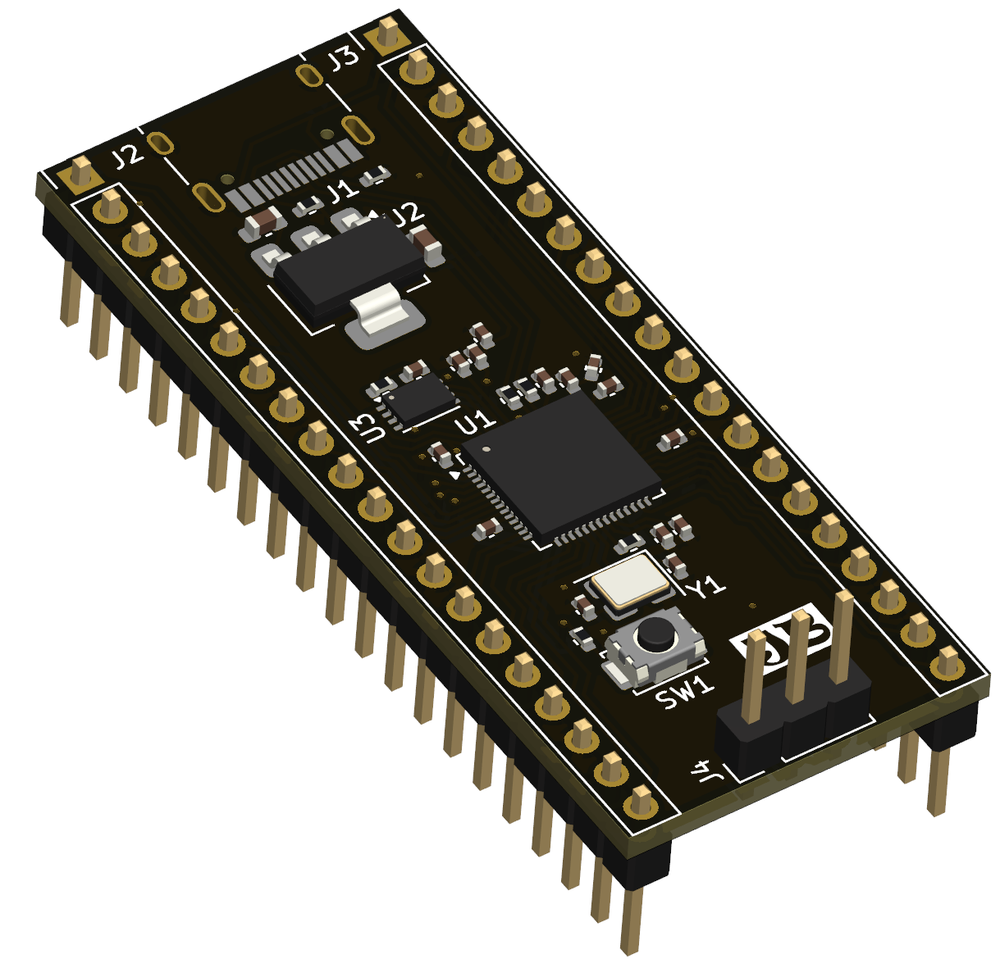
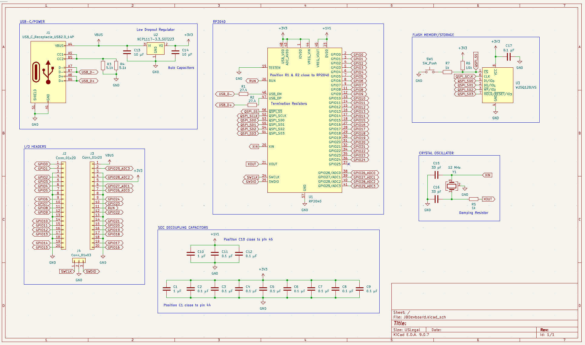
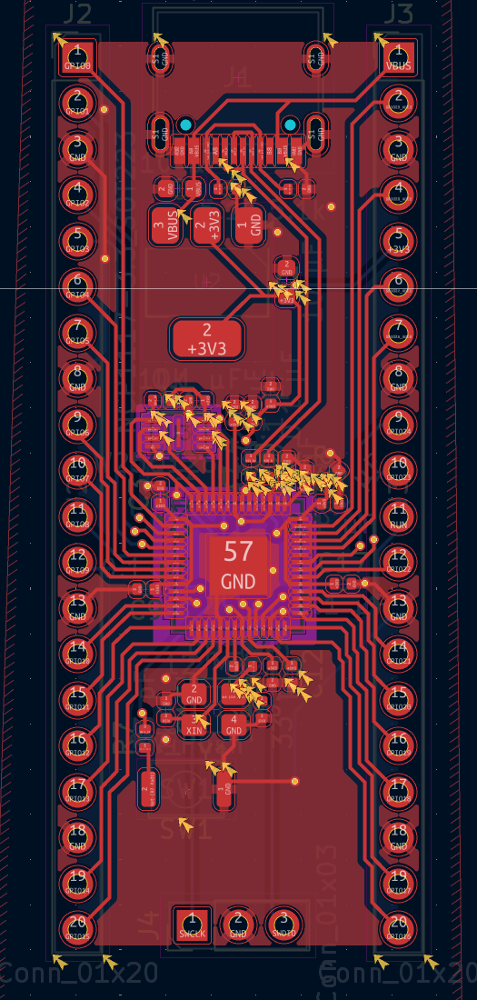
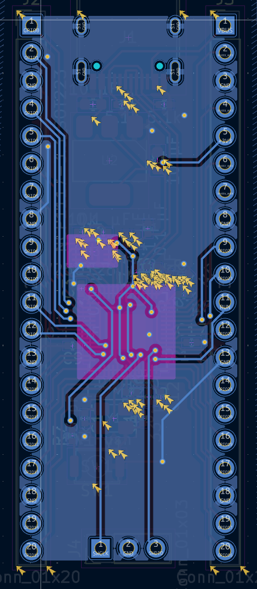

# JBDevboard
A custom RP2040 dev board utilizing a NCP1117 LDO. This project is a modified version of the RP2040 devboard project by [Kai Pereira](https://github.com/KaiPereira/build-a-devboard), which has served as a great resource for learning about devboard production. This board is essentially a clone of a Raspberry Pi RP2040 board.

Here is a look at the current build:

The large IC near the back of the board, labeled U2, is the NCP1117. It is capable of providing an output current of 1.0 A, which is an upgrade from the LDOs in the tutorial, which has a max output current of 250 mA.

Here's the schematic:
---

And here's what the trace layers look like:
---

---
### Bill of Materials
---

| Part | Quantity | Price Per | Link | 
| :--- | :---: | :---: | :--- |
| **RP2040** | 1 | $0.70 | [DigiKey](https://www.digikey.com/short/ndb2782v) |
| **NCP1117** | 1 | $0.37 | [DigiKey](https://www.digikey.com/short/5j4t47bt) |
| **USB-C Recepticle** | 1 | $0.47 | [DigiKey](https://www.digikey.com/short/z2dbcnt0) |
| **W25Q128JVEIM TR** | 1 | $2.31 | [DigiKey](https://www.digikey.com/short/mfqznn09) |
| **12 Mhz Xtal Osc** | 1 | $1.35 | [DigiKey](https://www.digikey.com/short/h02qvddd) |
| **1x20 Header** | 2 | $0.50 |[DigiKey](https://www.digikey.com/short/dqz7fj2b) |
| **1x3 Header** | 1 | $0.17 | [DigiKey](https://www.digikey.com/short/td5n0hbf) |
| **5.1k R 0402** | 2 | $0.10 |[DigiKey](https://www.digikey.com/short/c9z4njr9) |
| **27.4 R 0402** | 2 | $0.10 |[DigiKey](https://www.digikey.com/short/pqdzv9nf) |
| **1k R 0402** | 2 | $0.10 | [DigiKey](https://www.digikey.com/short/ptpr3b5v) |
| **10k R 0402** | 1 | $0.10 |[DigiKey](https://www.digikey.com/short/1bqf9rrt) |
| **0.1uF C 0402** | 11 | $0.03 |[DigiKey](https://www.digikey.com/short/prnwd7b4) |
| **1uF C 0402** | 1 | $0.08 | [DigiKey](https://www.digikey.com/short/bh2hq3n5) |
| **33pF C 0402** | 2 | $0.10 |[DigiKey](https://www.digikey.com/short/87qt971h) |
| **10uF C 0603** | 2 | $0.47 |[DigiKey](https://www.digikey.com/short/22nm5zq0) |
| **Push Button** | 1 | $0.41 | [DigiKey](https://www.digikey.com/short/8bz14998) |
| **PCB** | 1 | $2.10 | [JCLPCB](https://jlcpcb.com/) |
| **PCB Stencil** | 1 | $7.11 | [JCLPCB](https://jlcpcb.com/) |
| **JLCPCB Tax + Shipping** |  | ~$20.31 | |
| **DigiKey Tax + Shipping** |  | ~$8.56 | 
| **TOTAL** |  | $46.12 |

